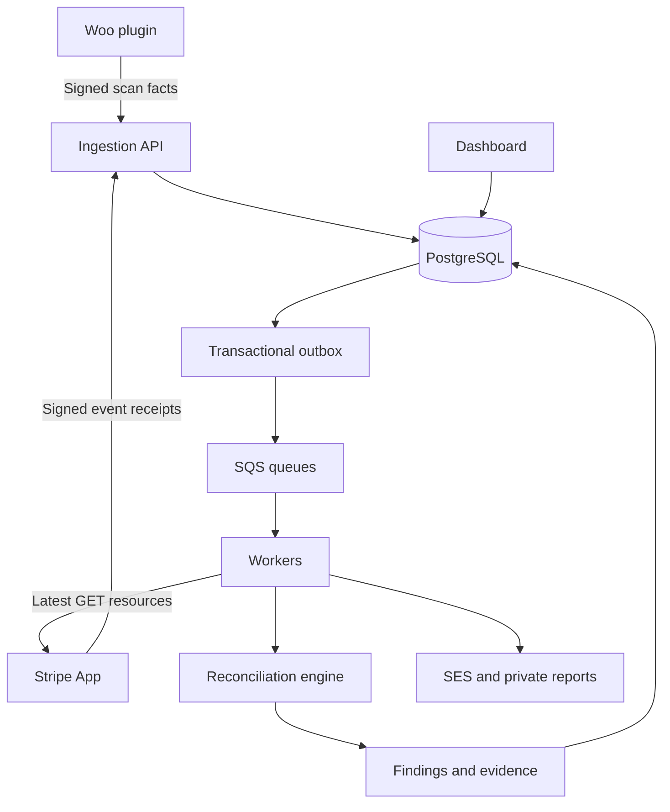

# Architecture

One modular monolith supplies HTTP requests, workers, scheduled maintenance and the offline CLI. The pure reconciliation package contains no database, HTTP or implicit clock dependency. SSR templates and a small external JavaScript file implement dashboard forms; the server remains the authorization authority.

## Data and correctness

Immutable observations record allowlisted source facts. Projections select the latest accepted revision. Equal revision with conflicting content fails closed and invalidates coverage; older events cannot rewind current state. A raw Stripe event is a delivery hint: workers fetch current resources before normalization. Charges and Checkout Sessions are aliases of a PaymentIntent, never additional successful payments.

Source namespace is organization, store/account, mode and identity. Confirmed exact identifiers outrank metadata. Conflicts yield PI-010; amount/time similarity is a suggestion only. The engine requires four complete fresh coverage ranges and holds facts beyond their shared boundary. A heartbeat does not prove that a scan completed.

Finding keys combine tenant, store, mode, rule and sorted identities. Grace produces provisional findings. Two consecutive clean evaluations at least five minutes apart resolve a finding; PI-009 also requires a coverage advance. Stale, disabled, shadow or ambiguous evaluations cannot establish clean financial evidence. External resolution records operator intent while retaining automatic evidence checks.

## Tenant boundary

All business rows carry UUIDv7, organization, timestamps and a version. FORCE RLS uses transaction-local settings, and composite tenant foreign keys prevent cross-tenant parents. Runtime is neither owner nor BYPASSRLS. Immutable audit, observations, runs and events reject updates; runtime cannot delete them. Maintenance has a separate credential and bounded deletion role.

Global Django identities/sessions and opaque routing tables are deliberate exceptions. TenantDirectory, ResourceLocator and PairingLocator contain routing IDs, token hashes or erasure metadata, not source facts or credentials. The membership bootstrap policy exposes only the authenticated user's membership rows.

## Delivery and recovery

Business changes and outbox intents commit together. SQS carries references, not credentials or raw payloads. The worker revalidates references against authoritative tenant rows, uses bounded retries and leaves exhausted work visible for reviewed replay. Woo persists an ID snapshot, scan position and pending page before sending; only contiguous acknowledged completion advances coverage.

External services have independent commit boundaries. Uncertain rotating OAuth refresh requires renewed consent. A crash after SES acceptance but before recording its message ID can repeat a message. Finding and security-sensitive owner-notification intents are transactionally recorded and deduplicated; recipient authority is checked again at delivery. End-to-end exactly-once delivery is not claimed.

AWS eu-west-1 resources are defined in Terraform; account approval and measured service objectives remain release gates. See [ADRs](adr/README.md), [deployment](deployment.md) and [operations](runbooks/README.md).
